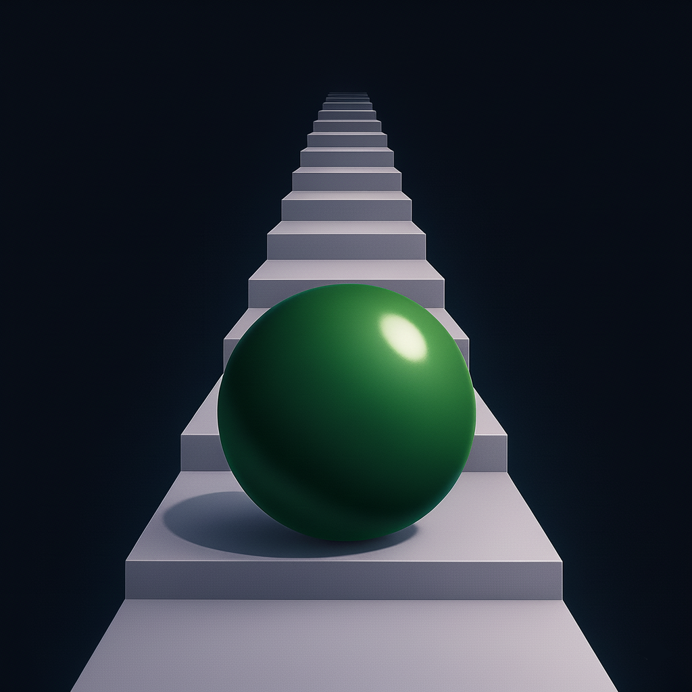

  
  <h1>Stairs</h1>

A game where you walk up stairs, step by step, until you give up...

Stairs was built using the methodology of [Vibe Coding](https://en.wikipedia.org/wiki/Vibe_coding), meaning this code was entirely built using AI, where the human only made requests and handled version control for the project. The code was mainly written by Claude Sonnet 3.7 but some of it was written/fixed-up with Gemini 2.5 Pro, o3, gpt-4o, and gpt-4.1. The game's icon was generated using OpenAI's gpt-4o model which supports image generation. These models were used by utilizing Anthropic's Claude web app, Cursor IDE, and Cha.

This game was inspired by the video, [Games that Don't Fake the Space](https://www.youtube.com/watch?v=Q85l1Fenc5w).

Also the music is from [this](https://www.youtube.com/watch?v=ad0a6TiuTnU) YouTube video.
