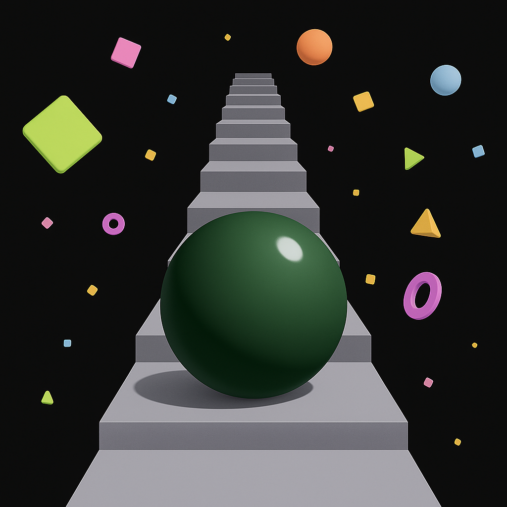

  
  <h1>Stairs</h1>

A game where you walk up stairs, step by step, until you give up...

This game was inspired by the video, [Games that Don't Fake the Space](https://www.youtube.com/watch?v=Q85l1Fenc5w).

To run this project, just open the `index.html` file in your browser and start playing!

Stairs was built using the methodology of [Vibe Coding](https://en.wikipedia.org/wiki/Vibe_coding), meaning this code was entirely written using AI, where the human only made requests and handled version control, though [git](https://git-scm.com/) & [GitHub](https://github.com/),for the project. The code was mainly written by `Claude Sonnet 3.7` and `Gemini 2.5 Pro`. But parts of it was written/refined with o3, `gpt-4o`, and `gpt-4.1`. The game's icon was generated using OpenAI's `gpt-4o image model`. These models were utilized though [Anthropic's Claude wep app](https://claude.ai/new), the [Cursor IDE](https://www.cursor.com/), and [Cha](https://github.com/MehmetMHY/cha/). And the music is from [this](https://www.youtube.com/watch?v=CeyIAgXeIL0) YouTube video, which was downloaded using [yt-dlp](https://github.com/yt-dlp/yt-dlp) and segmented/clipped using [ffmpeg](https://ffmpeg.org/).
